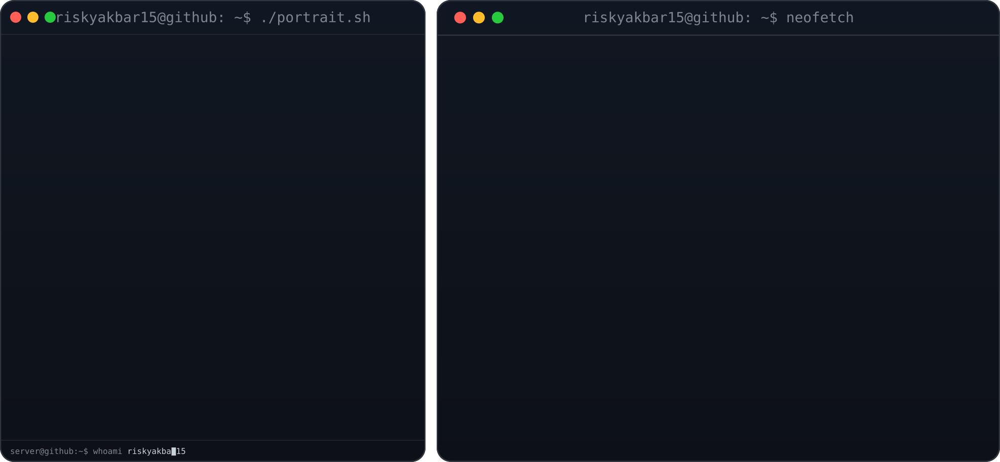
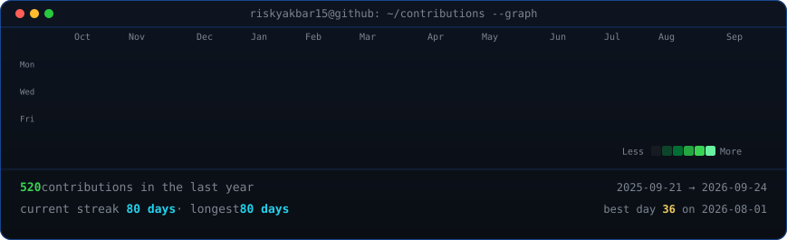

# Hi, there! 👋

<!-- markdownlint-disable MD033 -->

<!-- hero: monochrome ASCII portrait (types in) beside a neofetch-style info
     panel, combined into ONE svg so it never wraps. regenerate portrait:
     python scripts/prep_photo.py <photo> && python scripts/make_ascii_svg.py ;
     info panel: python scripts/make_info_card.py ; then: python scripts/make_hero.py -->

  

<code>$ whoami → developer • learner • cybersecurity enthusiast</code>

 

<code>$ cat stack.txt → languages • frameworks • databases • tools</code>

  

<!-- animated contribution graph: real data, boxes reveal cell by cell
     (regenerated daily by .github/workflows/update-profile-art.yml) git pull --rebase -->

